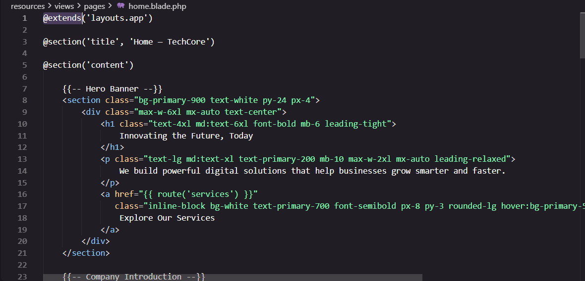
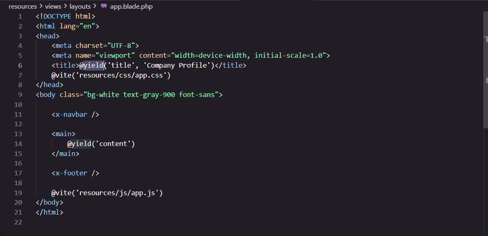
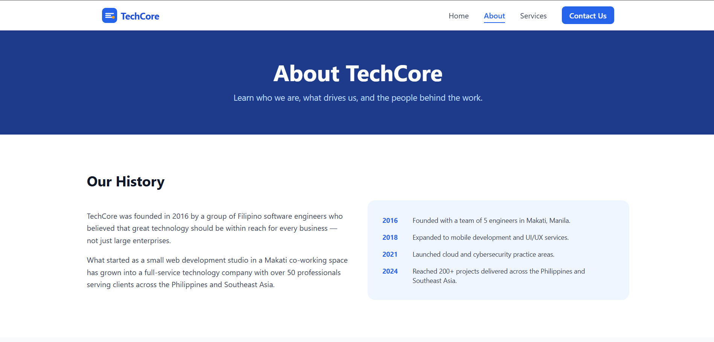
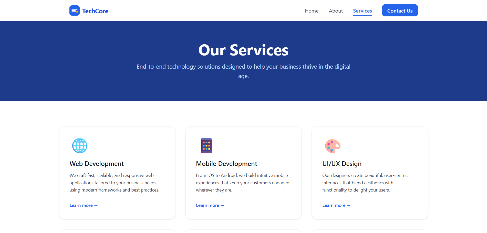
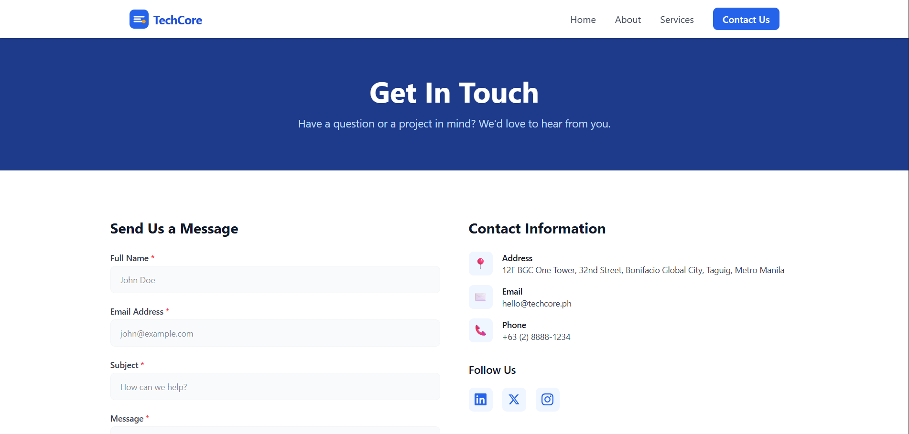

# Mini Project 02: Company Profile Website

## Project Title
**TechCore – Company Profile Website**


---

## Project Introduction

What is a Company Profile Website?

A Company Profile Website is a website that provides information about a company, including its background, services, goals, and contact information. It serves as the company's online presence and allows visitors to learn more about the organization and what it offers.

Why Businesses Need One

Businesses need a company profile website because it provides a professional online presence and allows potential customers to easily access information about the company. A website can also help establish credibility, showcase services, reach a wider audience, and provide customers with a convenient way to contact the business.

Purpose of the Project

The purpose of the TechCore Company Profile Website is to create a professional and user-friendly website that introduces TechCore and showcases its technology services. The project was developed using the Laravel framework and demonstrates the use of Laravel's MVC architecture, routing, controllers, and Blade templating engine.

TechCore provides the following services:

Web Development
Mobile Development
UI/UX Design
Cloud Solutions
Cybersecurity
IT Consulting

---

## Objectives

The following objectives were accomplished during the development of the project:

Develop a functional company profile website using Laravel.
Create a professional homepage for TechCore.
Provide an About page containing information about the company.
Create a Services page showcasing TechCore's technology services.
Create a Contact page where visitors can find company contact information.
Implement navigation between different website pages.
Apply Laravel's MVC architecture.
Create and configure Laravel routes.
Develop controllers to handle application requests.
Use Blade templates for reusable website layouts.
Organize website resources using Laravel's folder structure.
Create a responsive and user-friendly website interface.
Practice proper separation of concerns in web application development.

---

## MVC Architecture

### What is MVC?

MVC, or Model-View-Controller, is a software architecture pattern that separates an application into three main parts: the Model, View, and Controller.

Model – Handles data and communication with the database.
View – Handles what the user sees, such as HTML pages and website layouts.
Controller – Handles user requests and determines what information should be sent to the View.

In this project, the MVC architecture helps organize the different parts of the TechCore website and makes the application easier to develop and maintain.

### Why Laravel Uses MVC

Laravel uses MVC because it provides a structured way of developing web applications. Instead of placing routes, HTML, business logic, and database operations in one file, Laravel allows developers to separate these responsibilities into different components.

For example, the route receives a request, the controller processes the request, and the Blade view displays the appropriate page to the user.

### Advantages of MVC in Software Development

The MVC architecture provides several advantages:

**Separation of Concerns** – Each part of the application has a specific responsibility.

**Easier Maintenance** – Changes can be made to one part without unnecessarily affecting other parts.

**Code Reusability** – Views and components can be reused across multiple pages.

**Better Organization** – Project files are organized according to their purpose.

**Team Collaboration** – Developers can work on different parts of the application more easily.

**Scalability** – The architecture makes it easier to expand the application as it grows.

### Laravel Request Flow

```
   Browser
      │
      ▼
    Route
      │
      ▼
  Controller
      │
      ▼
  Blade View
      │
      ▼
   Response
      │
      ▼
   Browser
```

---

## Laravel Routing

**What is Routing?**

Routing is the process of determining which part of an application should handle a user's request. In Laravel, routes are commonly defined inside the routes/web.php file.

**Named Routes**

Named routes allow developers to give a specific name to a route. Instead of repeatedly writing a URL, the route name can be used when creating links.

**GET Requests**

A GET request is commonly used when a user wants to retrieve or display information from a website.

### Route Definitions

- **`Route::get()`** – Defines a route that responds to HTTP GET requests
- **First argument** (`'/'`, `'/about'`, etc.) – The URL path the route matches
- **Second argument** (`[CompanyController::class, 'home']`) – An array specifying the controller class and method to call when the route is matched
- **`->name('home')`** – Assigns a named route, allowing us to reference it in Blade templates using `route('home')`

---

## Controllers

**Purpose of Controllers**

Controllers are responsible for handling requests received by the application. They act as an intermediary between the routes and the views.

For example, when a visitor requests the About page, the route directs the request to the appropriate method in CompanyController. The controller then returns the corresponding Blade view.

**Benefits of Controllers**

Controllers provide several benefits:

Keep application logic organized.

Prevent routes from becoming unnecessarily large.

Make application functionality easier to maintain.

Allow related functionality to be grouped together.

Improve the overall organization of an MVC application.

### Controller Methods

- **`CompanyController extends Controller`** – Inherits from Laravel's base Controller class, gaining access to helper methods
- **`public function home()`** – Each method is called when its corresponding route is matched
- **`return view('pages.home')`** – Returns a Blade view. The dot notation `pages.home` maps to `resources/views/pages/home.blade.php`
- **Each method returns a view** – The controller's only job is to return the appropriate view. In a real application, controllers would also fetch data from Models before passing it to views.

---

## Blade Templating Engine

Blade is Laravel's built-in templating engine. It allows developers to create dynamic and reusable HTML templates while keeping the syntax simple and readable.

**Blade Layouts**

A Blade layout provides a common structure that can be shared by multiple pages.

For example, a layout can contain:

Navigation bar
Header
Main content area
Footer

Individual pages can then reuse this layout instead of repeating the same HTML code.


**Blade Components**

Blade components are reusable pieces of a website interface. They can be used for elements such as navigation bars, buttons, cards, and footers.

Using components reduces duplicate code and makes the website easier to maintain.

@extends

The @extends directive allows a Blade page to inherit a layout.

Example:

@extends('layouts.app')

This tells Blade that the page should use the specified layout.

@section

The @section directive defines content that will be inserted into a section of the layout.

Example:

@section('content')

<h1>Welcome to TechCore</h1>

<p>
    Technology solutions designed for modern businesses.
</p>

@endsection
@yield

The @yield directive defines where section content should appear in the layout.

Example:

<main>
    @yield('content')
</main>

The content from @section('content') will appear where @yield('content') is placed.

@include

The @include directive allows a Blade file to include another Blade file.

For example:

@include('partials.navbar')

This can be used to include a reusable navigation bar.






---

## Laravel Folder Structure

**Purpose of the Laravel Folders**

`app/` – The app/ directory contains the core application code. Controllers and other application-related classes are commonly located here.

`routes/` – Directory contains the application's route definitions.

`resources/` – Contains publicly accessible files such as compiled CSS, JavaScript, images, and the main entry point of the Laravel application.

`public/` – Contains publicly accessible files such as compiled CSS, JavaScript, images, and the main entry point of the Laravel application.

`bootstrap/` – Contains files used to initialize and bootstrap the Laravel framework.

`config/` – Contains configuration files for different parts of the Laravel application.

---

## Screenshots

**Home Page**

About page


Services Page


Contact Page


Navigation Bar


Footer


Route Definitions


Controller


Blade Layout


---

## Problems Encountered

### Problem 1 – Controller Namespace Issues

A controller namespace or import issue can occur when Laravel cannot properly locate the controller referenced by a route. This may result in a class-not-found error.

### Problem 2 – Blade Syntax Errors

Blade syntax errors can also occur when directives such as @extends, @section, @yield, or @include are incorrectly written or improperly closed.

### Problem 3 – Route Not Found

One of the challenges encountered was receiving a 404 Route Not Found error when trying to access a page. This happened when the requested URL did not match an existing route definition.

---

## Solutions

Solution 1 – Controller Namespace Issues

The controller namespace and import statement were checked to ensure Laravel could locate the controller.

Example:

use App\Http\Controllers\CompanyController;

The controller namespace was also checked:

namespace App\Http\Controllers;

Solution 2 – Blade Syntax Errors

Blade directives were checked to ensure they were correctly opened and closed.

For example:

@extends('layouts.app')

@section('content')

    <h1>TechCore</h1>

@endsection

The Blade files were then tested through the browser to verify that the pages loaded correctly.

Solution 3 – Route Not Found

The route definitions in routes/web.php were checked to make sure that the correct URL and HTTP method were being used. The route was then tested again in the browser.

Example:

Route::get('/about', [CompanyController::class, 'about'])
    ->name('about');

---

## Reflection

Developing the TechCore Company Profile Website using Laravel helped me understand how the MVC architecture organizes a web application and separates its different responsibilities. Before working with Laravel, it was easy to think of a website as simply a collection of HTML pages. Through this project, I learned that a framework such as Laravel provides a structured approach that makes it easier to develop, manage, and expand an application.

One of the most important concepts I learned was MVC, which stands for Model, View, and Controller. The Model is responsible for handling data, the View is responsible for what the user sees, and the Controller processes requests and connects the application's logic with the appropriate view. Even though the TechCore company profile website mainly focuses on displaying information, understanding MVC provides a foundation that can be applied to more complex applications with databases and user interactions.

I also learned why separation of concerns is important. Instead of placing all of the application's code in one location, Laravel separates routes, controllers, views, and other resources. This makes the project easier to understand and maintain. For example, routes determine which URL should be accessed, controllers handle the request, and Blade views are responsible for presenting the result to the user. If the design of a page needs to be changed, the Blade files can be modified without unnecessarily changing the routing logic.

The relationship between routes, controllers, and views became clearer during the development process. When a user visits a URL, Laravel first checks the route in web.php. The route can then send the request to a method in the appropriate controller. The controller processes the request and returns a Blade view. Blade generates the HTML that is ultimately sent back to the user's browser. Understanding this request flow helped me troubleshoot problems such as incorrect routes, missing views, and controller errors.

The MVC architecture can also be applied to larger enterprise systems. As an application becomes larger, having clearly separated responsibilities becomes even more important. Developers can work on controllers, views, database models, and other components without placing everything in a single area of the application. This improves collaboration, maintainability, testing, and scalability.

Overall, this project improved my understanding of Laravel and modern web application development. I learned that frameworks are not only tools for creating websites faster, but also provide architectural patterns that help developers build applications that are organized, maintainable, and scalable.

---

## Linkedin Post 
https://www.linkedin.com/feed/update/urn:li:activity:7494277766461440000/


## References

- Laravel Documentation. (n.d.). *Routing*. https://laravel.com/docs/routing
- Laravel Documentation. (n.d.). *Controllers*. https://laravel.com/docs/controllers
- Laravel Documentation. (n.d.). *Blade Templates*. https://laravel.com/docs/blade
- Tailwind CSS Documentation. (n.d.). *Utility-First CSS Framework*. https://tailwindcss.com/docs
- Google Fonts. (n.d.). *Inter Font Family*. https://fonts.google.com/specimen/Inter
- PHP Documentation. (n.d.). *PHP Manual*. https://www.php.net/docs.php
- MDN Web Docs. (n.d.). *HTML, CSS, and JavaScript Reference*. https://developer.mozilla.org/